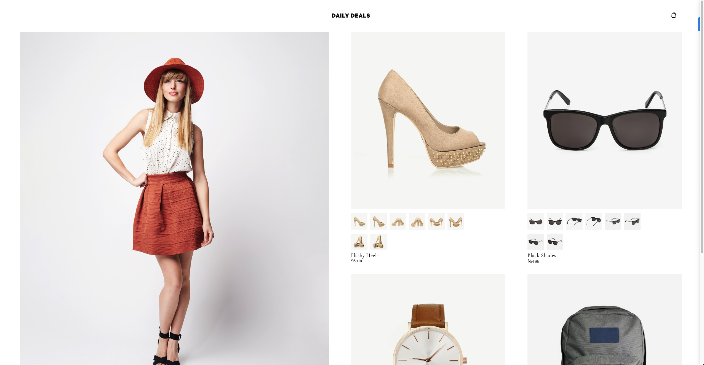
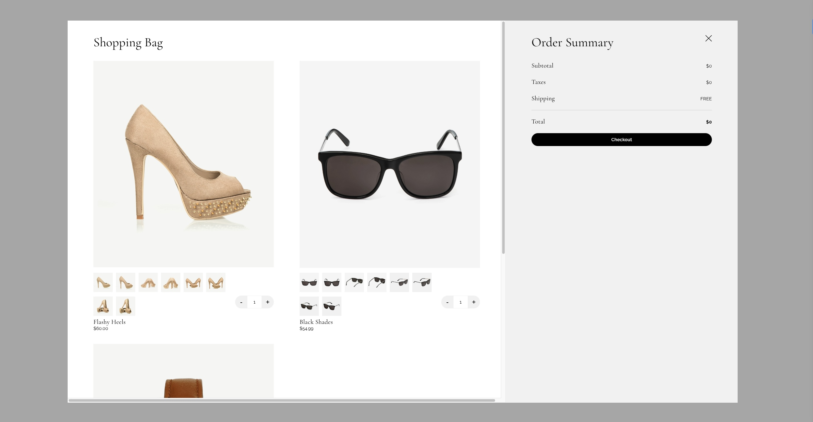
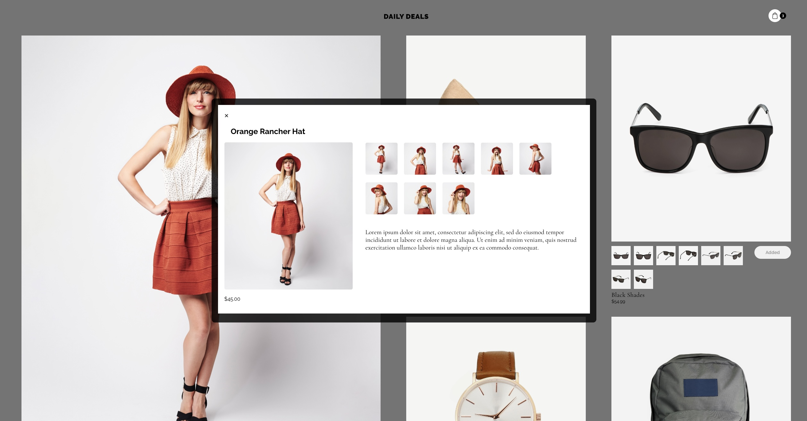

# Work & Co assessment (Zhandos Arinov)

- [Screenshots](#screenshots)
- [Features Added](#features-added)
- [Technologies Used](#technologies-used)
- [Getting Started](#getting-started)
  - [Installation](#installation)
- [License](#license)

<h2 id="screenshots">Screenshots</h2>

Here are some screnshots of Project:

### Home Page

### Cart Page

### Modal Page

<h2 id="features-added">Features Added</h2>

<h3>1. Implement Product Details Page</h3>

- Users should be able to open the product modal from both the homepage and Cart modal, or navigate to a route in the format /product/:productId
- Clicking on the product name or image should open the product modal
- Closing the Product modal should take the user to the homepage, no matter where they came from
- Implement the PDP image picker, so clicking on a thumbnail changes the featured image (no animation/transition between images is required)
- Don't worry about wiring up quantity/Add to Bag buttons
- No specific loading/404 behavior is required, as long as these events do not lead to an error

<h2 id="technologies-used">Technologies Used</h2>

- React.js
- React hooks
- React-Router
- JavaScript
- CSS (media queries)

<h2 id="getting-started">Getting Started</h2>

<h3 id="installation">Installation</h3>

To run the project locally, follow these steps:

1. Clone this repository: `git clone https://github.com/jandos0492/work-co-assessment.git`
2. Navigate to the project directory: `cd work-co-assessment`
3. Install the dependencies: `npm install`
4. Start the development server: `npm start`
    - The website should now be accessible in your browser at: `http://localhost:3000`

<h2 id="license">License</h2>

This project is licensed under the MIT License.